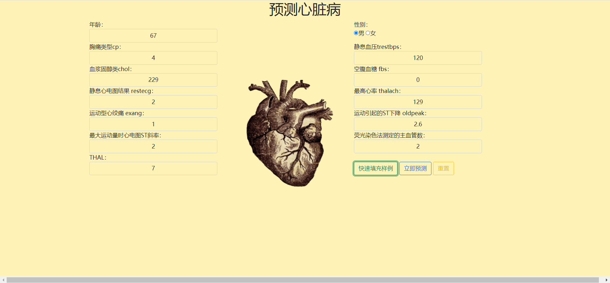
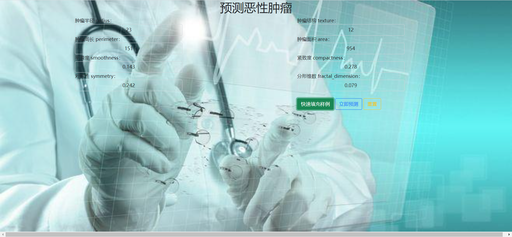
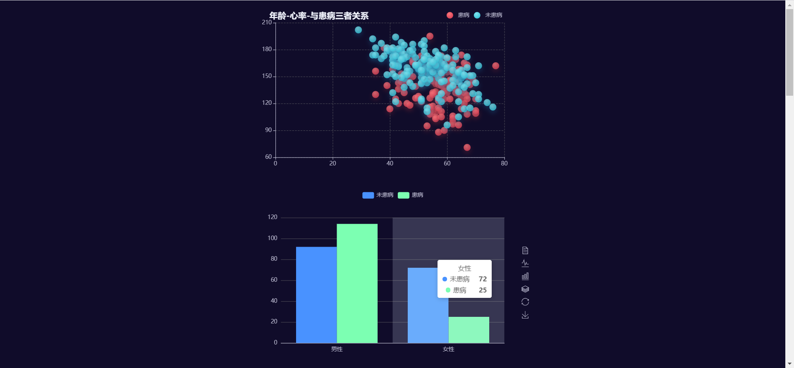

# 医疗辅助诊断系统

使用公共数据集训练，利用机器学习算法，训练模型；使用python Flask 框架搭建简易的医疗辅助诊断系统

- 心脏病预测
- 恶性肿瘤预测
- 糖尿病预测
- 可视化结果

#### 所需环境：

- python3
- pandas==1.1.5
- Flask==1.1.2
- PyMySQL==1.0.2
- numpy==1.19.5
- scikit_learn==0.24.1

